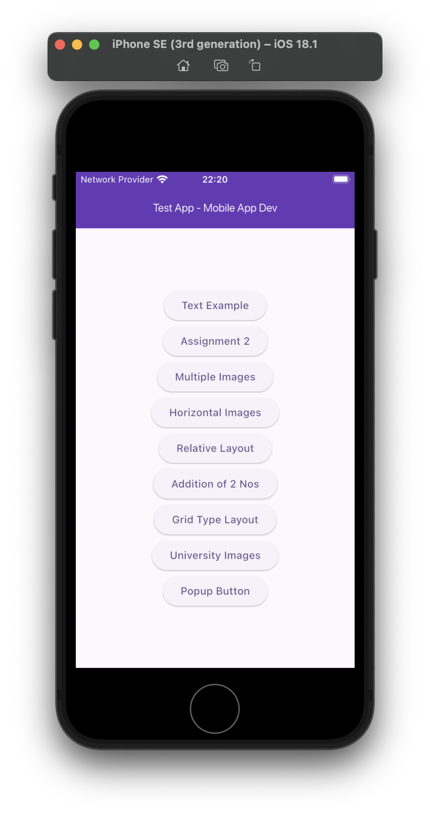
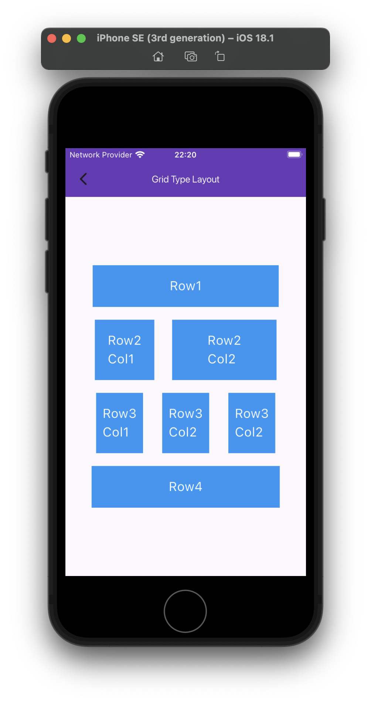
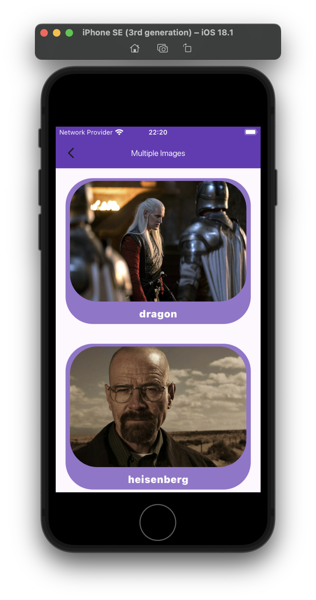
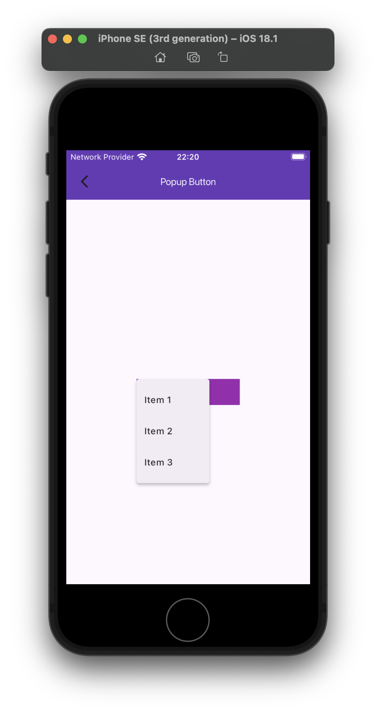
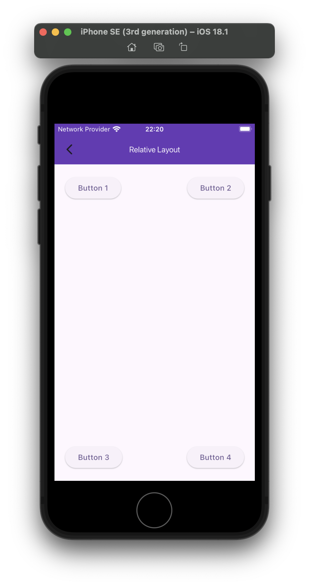
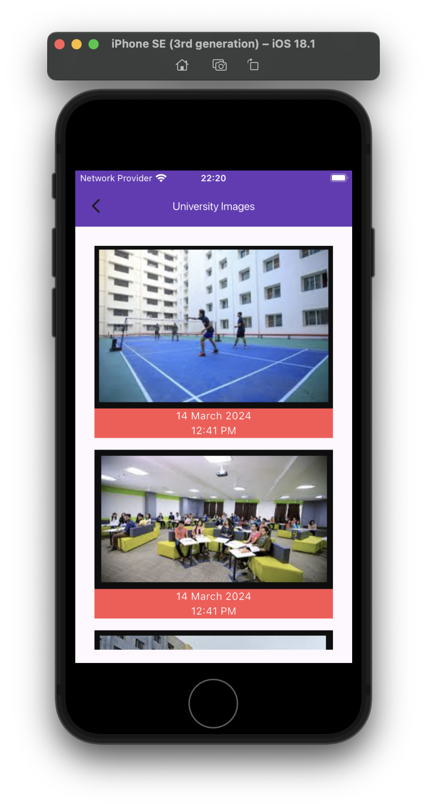

# Test App 🧪

This test app was created in order to demonstrate the principles of mobile application development in mobile app dev course of a University.

## Architecture 🏗️

The app follows the **Model-View-Controller (MVC)** architecture for clean and maintainable code.

### Project Structure 🌳

```
lib/
├── controllers/        # Contains all the business logic
├── models/             # Contains data models
├── views/              # Contains UI screens and pages
│   ├── widgets
│   ├── screens
├── utils/              # Utility files
│   ├── constants      # constant files
│   ├── theme     # App-wide styling
└── main.dart           # Entry point of the app
```

---

## Dependencies 📦

Here are the key dependencies used in the project:

- **cupertino_icons**: ^1.0.2
- **provider**: ^6.1.2

---

## Screenshots 📸

|||||||

---

## How to Run 🚀

1. **Clone the repository**:
   ```bash
   git clone https://github.com/asmitranjansinha/mobile-app-dev-vitb.git
   ```
2. **Navigate to the project directory**:
   ```bash
   cd mobile-app-dev-vitb
   ```
3. **Install dependencies**:
   ```bash
   flutter pub get
   ```
4. **Run the app**:
   ```bash
   flutter run
   ```

---
